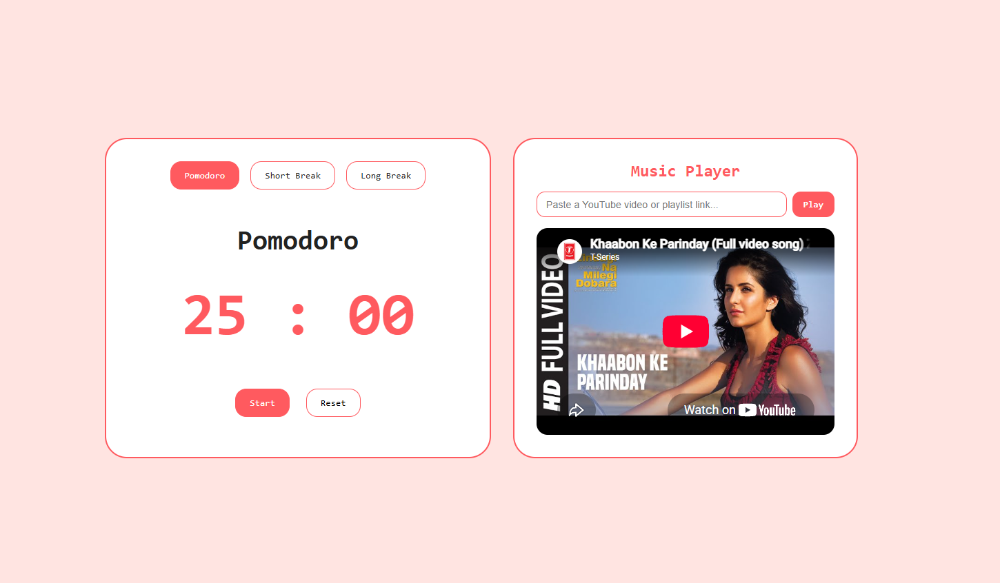

# Pomodorro Timer
A simple pomodoro timer built to help people stay disciplined and commit to focused work sessions.

## Live Demo
[View Live](https://pomodorro-timer-ecru.vercel.app)

## Preview

## Built with 
<table>
<tr>
    <td align="center">
     
    React
    </td>
    <td align="center">
     
    Vite
    </td>
    <td align="center">
     
    CSS
    </td>
</tr>
</table>

## Features
- Pomodoro, Short Break, and Long Break timer modes
- Click-to-edit timer duration (click the time to type a custom value; Enter confirms, Esc cancels)
- Start, stop, and reset — reset returns to your edited duration, not the original preset
- Background music player — paste any YouTube video, playlist, or Shorts link to play alongside your session

## Planned
- [ ] Progress indicator
- [ ] Pixelated theme
- [ ] Custom session duration
- [ ] Sound notification when the timer ends
